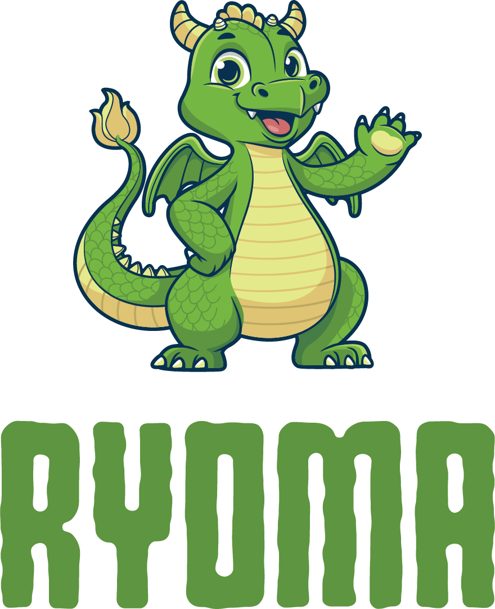
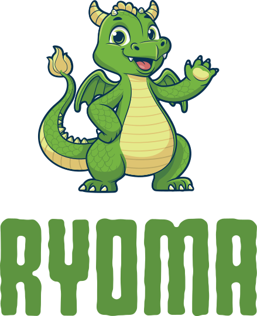
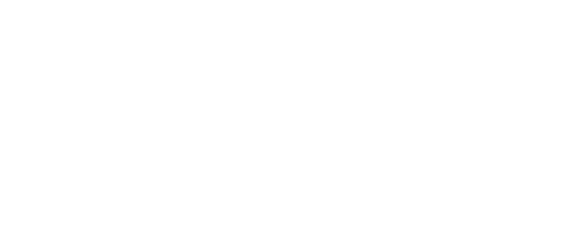
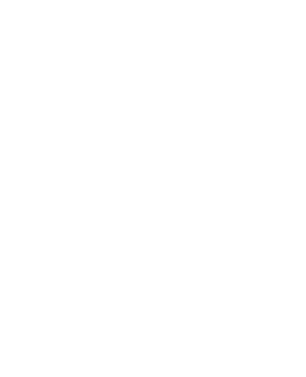
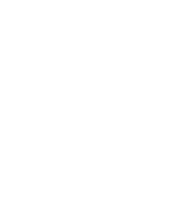
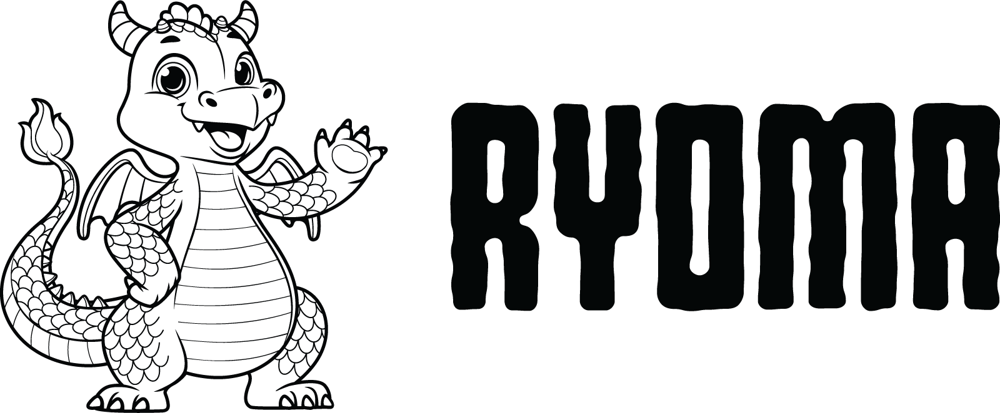
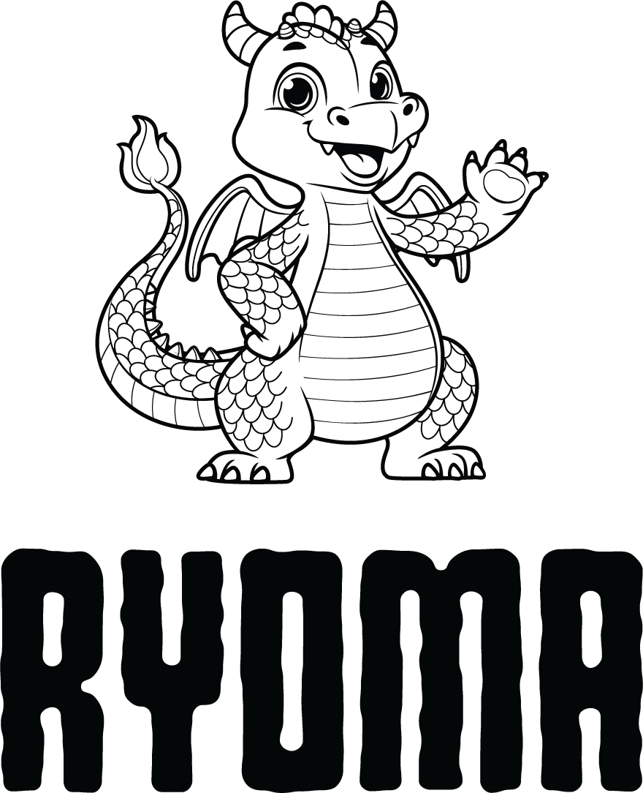

# Ryoma Related Logos and Artwork
In this repo, we provide Ryoma artwork in 2 standard formats (PNG/SVG), and in 3 versions (color/black/white). 

<table class="logos-table">
	<thead>
		<tr>
			<th></th>
			<th colspan="3">PNG</th>
			<th colspan="3">SVG</th>
		</tr>
		<tr>
			<th></th>
			<th>horizontal</th>
			<th>stacked</th>
			<th>icon</th>
			<th>horizontal</th>
			<th>stacked</th>
			<th>icon</th>
		</tr>
	</thead>	
    <tbody>
		<tr>
			<th>color</th>
			<td></td>
			<td></td>
			<td></td>
			<td></td>
			<td></td>
			<td></td>
		</tr>
		<tr>
			<th>white</th>
			<td></td>
			<td></td>
			<td></td>
			<td></td>
			<td></td>
			<td></td>
		</tr>
		<tr>
			<th>black</th>
			<td></td>
			<td></td>
			<td></td>
			<td></td>
			<td></td>
			<td></td>
		</tr>
	</tbody>	
</table>

If you're interested in using only the name of the project versus the logo with the dragon, please use these: https://github.com/project-ryoma/artwork/tree/main/text

# Use of trademark or logo 
Please refer to the Linux Foundation Trademark Usage page to learn about the usage policy and guidelines: https://www.linuxfoundation.org/trademark-usage. 

# Questions? 
Please email info@lfaidata.foundation.
